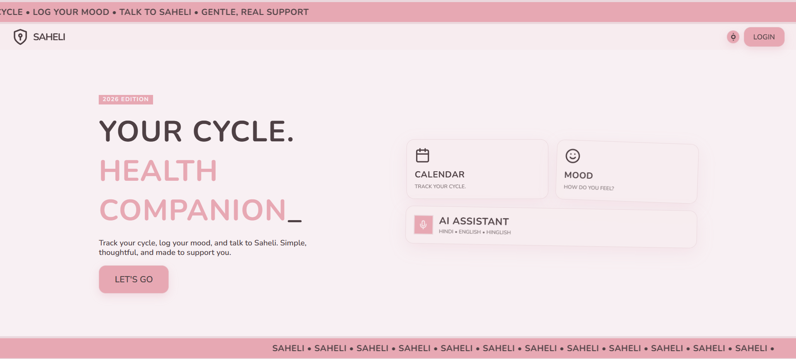
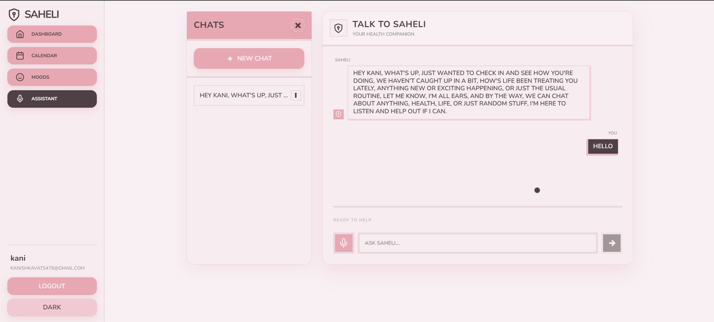

# Saheli

Saheli is a menstrual health companion app built with SvelteKit, Supabase, and Groq. It supports authenticated and guest usage, period and mood tracking, and a multilingual AI assistant (English/Hindi/Hinglish) with optional voice input.



## Current Features

- AI assistant with text + voice input (`/api/chat`)
- Period tracking with calendar visualization and simple prediction
- Mood check-ins with energy/symptoms/notes
- Guest mode (cookie/sessionStorage based) and authenticated mode (Supabase Auth + Postgres)
- Account settings with profile update and permanent account deletion
- Row Level Security (RLS) on all app tables

## Tech Stack

- Frontend: SvelteKit 2, Svelte 5 (runes), Tailwind CSS 4
- Backend: SvelteKit server routes/actions
- Database/Auth: Supabase Postgres + Supabase Auth + RLS
- AI: Groq (`whisper-large-v3-turbo` for transcription, `llama-3.3-70b-versatile` for chat)
- Adapter/Deploy target: `@sveltejs/adapter-vercel`
- Validation: Zod

## Screenshots

| Dashboard | AI Assistant |
|-----------|--------------|
|  |  |

| Calendar | Mood Tracker |
|----------|--------------|
|  |  |
## Architecture Overview

### 1) App lifecycle and auth context

- `src/hooks.server.ts`
  - Creates server Supabase client on every request (`event.locals.supabase`)
  - Defines `locals.safeGetSession()` that validates cookie session with `auth.getUser()`
  - Applies basic in-memory IP rate limiting
  - Appends security headers (`HSTS`, `X-Frame-Options`, etc.)
- `src/routes/+layout.server.ts`
  - Exposes `{ session, user }` to the app
- `src/routes/+layout.svelte`
  - Listens to auth state changes and invalidates SvelteKit data when auth changes

### 2) Route architecture

- `src/routes/login/*`: sign in, sign up, guest entry
- `src/routes/auth/callback/+server.ts`: Supabase auth callback code exchange
- `src/routes/dashboard/+layout.server.ts`:
  - Allows authenticated users
  - Allows guest users via `saheli_guest=true` cookie
  - Loads profile + recent period/mood data
- `src/routes/dashboard/*`: home/settings, calendar, mood, assistant
- `src/routes/api/chat/+server.ts`: AI endpoint

### 3) Supabase integration

- Browser client: `src/lib/supabase/client.ts`
- Server client: `src/lib/supabase/server.ts`
- DB schema/migrations:
  - `supabase/migrations/001_schema.sql`: core tables, RLS policies, signup trigger
  - `supabase/migrations/002_add_username.sql`: username backfill + constraints
  - `supabase/migrations/003_delete_my_account_rpc.sql`: authenticated self-delete RPC

### 4) Data model

- `profiles` (1:1 with `auth.users`, includes display/language/cycle settings)
- `period_logs`
- `mood_logs`
- `chat_history`

All tables are protected by RLS ownership policies (`auth.uid()` checks).

## Feature Flows

### Authentication and guest mode

- Login/signup runs in `src/routes/login/+page.svelte` with Supabase browser client.
- Guest mode sets cookies (`saheli_guest`, optional `saheli_display_name`).

### Dashboard profile/settings

- Profile edits are submitted from `src/routes/dashboard/+page.svelte` via client-side `profiles.upsert`.
- Account deletion posts to server action `?/deleteAccount` in `src/routes/dashboard/+page.server.ts`.

### Account deletion (current behavior)

1. Guest user: clears guest cookies and redirects to `/login`.
2. Authenticated user:
   - First tries RPC `delete_my_account` (recommended path).
   - If RPC fails and fallback vars exist, uses admin `deleteUser` with service role.
3. Signs out and clears Supabase auth cookies.

Deleting from `auth.users` cascades related rows because tables reference `auth.users(id) on delete cascade`.

### Mood tracking

- Server load/actions exist in `src/routes/dashboard/mood/+page.server.ts`.
- Current UI behavior in `src/routes/dashboard/mood/+page.svelte` performs writes directly from browser Supabase client for authenticated users.
- Guest mood entries are stored in `sessionStorage` via `src/lib/stores/guestStore.svelte.ts`.

### Calendar / period tracking

- Server action exists in `src/routes/dashboard/calendar/+page.server.ts`.
- Current UI behavior in `src/routes/dashboard/calendar/+page.svelte` performs writes directly from browser Supabase client for authenticated users.
- Guest period logs are stored in `sessionStorage`.

### AI assistant

- UI component: `src/lib/components/VoiceAssistant.svelte`
- Endpoint: `src/routes/api/chat/+server.ts`
  - Accepts text JSON or multipart audio
  - Uses Groq Whisper for transcription when audio is sent
  - Fetches profile + period/mood context for authenticated users
  - Builds contextual system prompt
  - Calls Groq chat completion (`llama-3.3-70b-versatile`)
  - Persists user/assistant messages to `chat_history` (authenticated users)

### Assistant history/session grouping

- `src/routes/dashboard/assistant/+page.server.ts` loads and groups history:
  - Manual boundary marker: `__NEW_CHAT_BOUNDARY__`
  - Time split fallback: new session if gap > 2 hours

## Environment Variables

Create `.env` in project root:

```env
PUBLIC_SUPABASE_URL="https://your-project.supabase.co"
PUBLIC_SUPABASE_PUBLISHABLE_DEFAULT_KEY="your-supabase-publishable-key"
GROQ_API_KEY="your-groq-api-key"

# Optional fallback only (used if RPC delete path fails)
SUPABASE_SERVICE_ROLE_KEY="your-supabase-service-role-key"
```

Used in code:

- `PUBLIC_SUPABASE_URL`: browser/server Supabase clients, delete fallback client
- `PUBLIC_SUPABASE_PUBLISHABLE_DEFAULT_KEY`: browser/server Supabase clients
- `GROQ_API_KEY`: `/api/chat`
- `SUPABASE_SERVICE_ROLE_KEY`: account deletion fallback path

## Local Setup

### Prerequisites

- Node.js 22+ (project engines specify `>=22`)
- npm (or Bun, optional)
- Supabase project
- Groq API key

### 1. Install dependencies

```bash
git clone https://github.com/kanishka-vats/saheli.git
cd saheli
npm install
```

### 2. Configure environment

- Add `.env` with the variables listed above.

### 3. Run Supabase SQL migrations

In Supabase SQL Editor, run in order:

1. `supabase/migrations/001_schema.sql`
2. `supabase/migrations/002_add_username.sql`
3. `supabase/migrations/003_delete_my_account_rpc.sql`

### 4. Start development server

```bash
npm run dev
```

Open `http://localhost:5173`.

## Scripts

- `npm run dev` - start local dev server
- `npm run build` - production build
- `npm run preview` - preview built app
- `npm run check` - Svelte + TypeScript diagnostics
- `npm run predeploy` - dependency + SAST scans (`npm audit`, `njsscan`)

## Project Structure

```text
src/
  hooks.server.ts
  app.d.ts
  lib/
    components/
      Calendar.svelte
      MoodCheckin.svelte
      VoiceAssistant.svelte
    stores/
      guestStore.svelte.ts
    supabase/
      client.ts
      server.ts
    schemas.ts
  routes/
    +layout.server.ts
    +layout.svelte
    login/
    auth/callback/
    api/chat/
    dashboard/
      +layout.server.ts
      +layout.svelte
      +page.svelte
      +page.server.ts
      assistant/
      calendar/
      mood/
supabase/
  migrations/
    001_schema.sql
    002_add_username.sql
    003_delete_my_account_rpc.sql
```

## Security Notes

- RLS is enabled on all core tables.
- Ownership policies restrict access by `auth.uid()`.
- Session validation uses server `auth.getUser()` checks.
- Basic in-memory rate limiting exists at hook level.
- Security headers are set globally in `hooks.server.ts`.

## Known Limitations

- Current mood/calendar/profile write paths are primarily client-driven; server actions exist but are not the only write path.
- In-memory rate limiting is per process and not distributed.
- AI responses are supportive guidance, not medical diagnosis.


