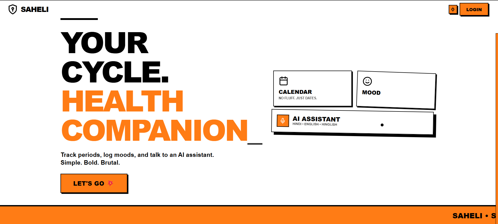
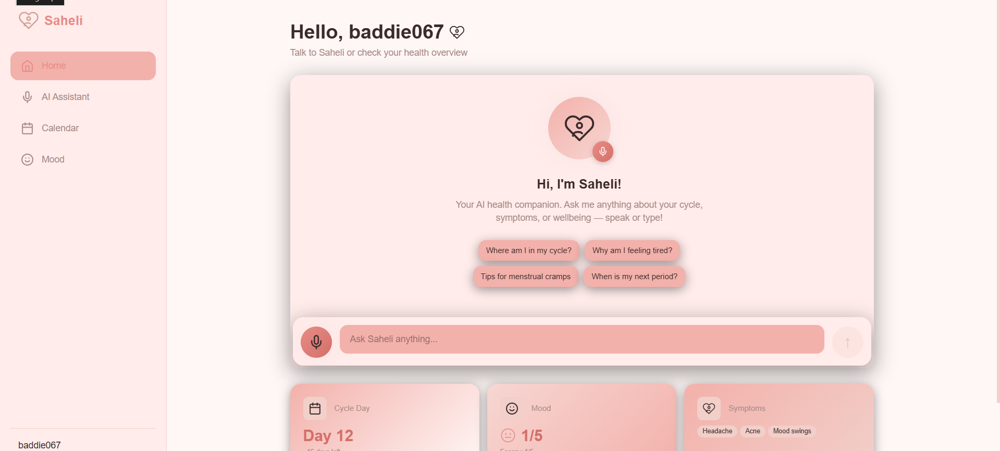
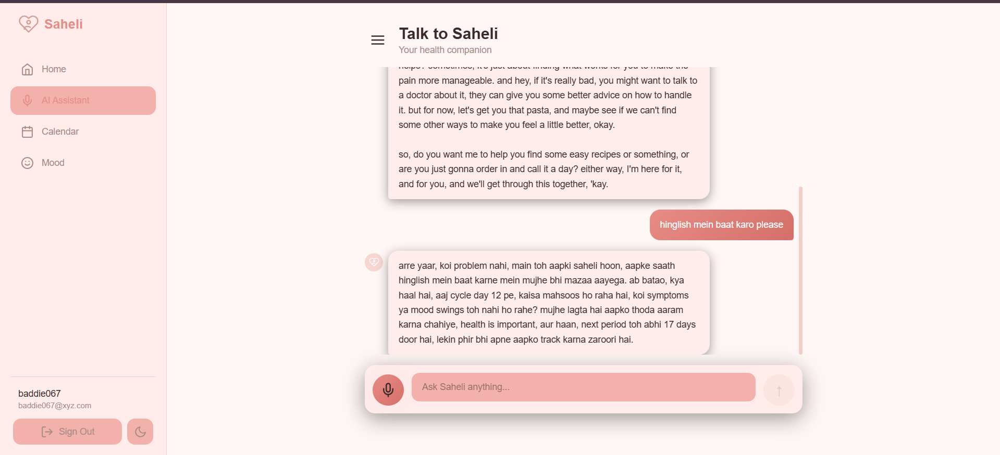
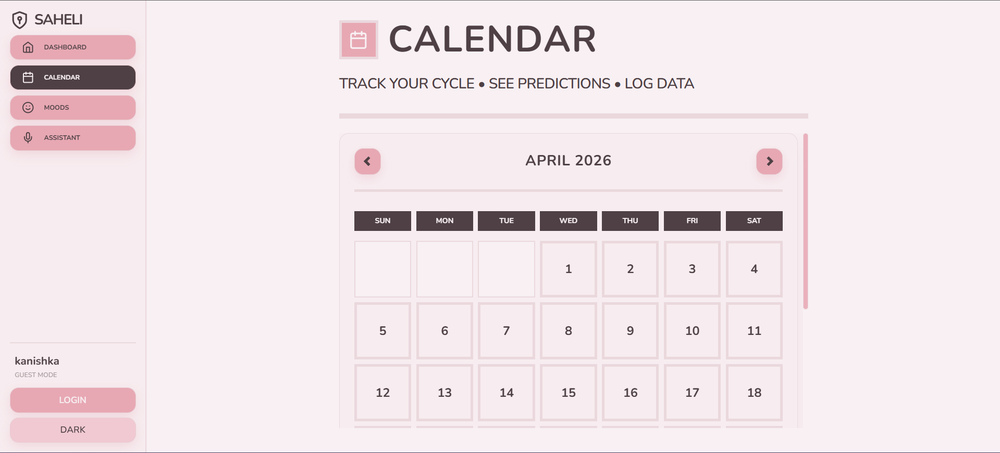
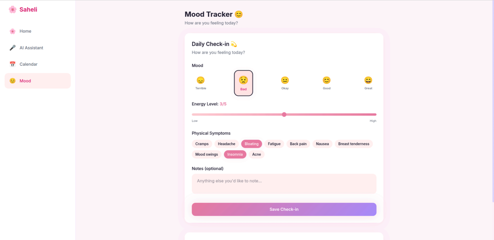

# Saheli

A menstrual health assistant web app built with SvelteKit, Supabase, and Groq AI. Track your periods, log your moods, and talk to an AI companion that understands your cycle — in English, Hindi, or Hinglish.



## Features

- **AI Voice Assistant** — Talk or type to Saheli. She uses your cycle and mood data to give context-aware health advice. Powered by Groq (Whisper for speech-to-text, LLaMA for chat).
- **Period Calendar** — Visual monthly calendar that highlights active period days and predicts future ones based on your average cycle length.
- **Mood Tracker** — Quick daily check-ins for mood, energy level, and physical symptoms.
- **Multilingual** — Works in English, Hindi, and Hinglish. The AI matches your language preference.
- **Text-to-Speech** — Saheli reads her responses aloud using the Web Speech API.
- **Data Privacy** — Row Level Security on all tables. Users can only see their own data.

## Screenshots

| Dashboard | AI Assistant |
|-----------|-------------|
|  |  |

| Calendar | Mood Tracker |
|----------|-------------|
|  |  |

## Tech Stack

- **Frontend** — SvelteKit 2, Svelte 5 (Runes), Tailwind CSS 4
- **Backend** — SvelteKit server routes, Bun runtime
- **Database & Auth** — Supabase (PostgreSQL + Row Level Security + Auth)
- **AI** — Groq SDK (Whisper large-v3-turbo for STT, LLaMA 3.1 8B for chat)
- **TTS** — Web Speech API (browser-native)

## Setup

### Prerequisites

- [Bun](https://bun.sh) installed
- A [Supabase](https://supabase.com) account (free tier works)
- A [Groq](https://console.groq.com) API key (free tier works)

### 1. Clone and install

```bash
git clone https://github.com/kanishka-vats/saheli.git
cd saheli
bun install
```

### 2. Create a Supabase project

1. Go to [supabase.com/dashboard](https://supabase.com/dashboard) and create a new project.
2. Once created, go to **Settings > API** and copy:
   - **Project URL** (looks like `https://xxxxx.supabase.co`)
   - **anon/public key** (starts with `eyJ...` or `sb_publishable_...`)

### 3. Get a Groq API key

1. Go to [console.groq.com/keys](https://console.groq.com/keys)
2. Create a new API key and copy it.

### 4. Set up environment variables

Create a `.env` file in the project root:

```env
GROQ_API_KEY="your-groq-api-key"
PUBLIC_SUPABASE_URL="https://your-project.supabase.co"
PUBLIC_SUPABASE_PUBLISHABLE_DEFAULT_KEY="your-supabase-anon-key"
```

### 5. Create the database tables

1. In your Supabase dashboard, go to **SQL Editor**.
2. Click **New query**.
3. Copy the entire contents of `supabase/migrations/001_schema.sql` and paste it in.
4. Click **Run**.

This creates four tables (`profiles`, `period_logs`, `mood_logs`, `chat_history`) with Row Level Security policies and an auto-profile trigger.

### 6. Disable email confirmation (optional but recommended)

1. In Supabase, go to **Authentication > Providers > Email**.
2. Uncheck **Confirm email**.
3. Save.

This lets users sign up and start using the app immediately without waiting for a confirmation email.

### 7. Run the app

```bash
bun run dev
```

Open [http://localhost:5173](http://localhost:5173) in your browser.

## Project Structure

```
src/
├── hooks.server.ts                 # Supabase SSR auth
├── lib/
│   ├── supabase/
│   │   ├── server.ts               # Server-side Supabase client
│   │   └── client.ts               # Browser-side Supabase client
│   └── components/
│       ├── Calendar.svelte          # Period calendar with predictions
│       ├── MoodCheckin.svelte       # Daily check-in form
│       └── VoiceAssistant.svelte    # Chat + voice + TTS
└── routes/
    ├── login/                       # Auth page
    ├── auth/callback/               # PKCE code exchange
    ├── api/chat/                    # Groq AI endpoint
    └── dashboard/
        ├── calendar/                # Period tracking
        ├── mood/                    # Mood logging
        └── assistant/               # AI chat page
```

## How the AI works

When you send a message (text or voice), the `/api/chat` endpoint:

1. **Transcribes** audio using Groq's Whisper model (if voice input).
2. **Fetches context** — your last 3 months of period logs and mood data from Supabase.
3. **Builds a prompt** that includes your cycle day, recent symptoms, mood trends, and language preference.
4. **Calls LLaMA 3.1** via Groq with the context-enriched prompt.
5. **Saves** both your message and the AI response to chat history.
6. **Speaks** the response aloud using the Web Speech API.
